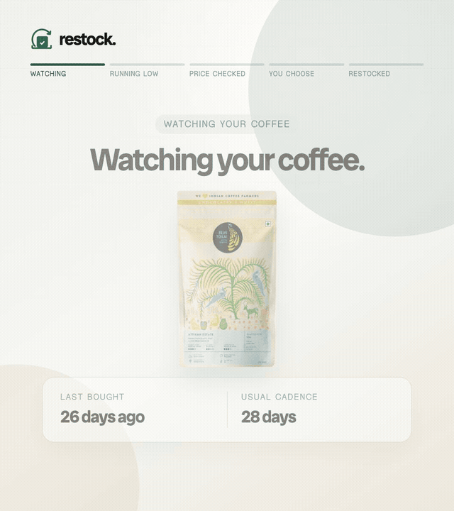

# Prava-Restock: Autonomous Restock & SaaS Renewal Agent

<div align="center">

[](https://github.com/somuai/Prava-Restock/actions)
[](LICENSE)
[](https://python.org)
[](https://fastapi.tiangolo.com)
[](https://react.dev)
[-336791.svg)](https://neon.tech)
[-46E3B7.svg)](https://prava-restock.onrender.com/app/)

**An Autonomous Agentic AI system that predicts consumption cadences, tracks price volatility, arbitrates merchant quotes, and securely delegates transactions via Prava Session Mandates with human-in-the-loop passkey guardrails.**

[Live Demo](https://prava-restock.onrender.com/app/) • [System Architecture](#system-architecture) • [Agentic Capabilities](#agentic-ai-architecture) • [Quick Start](#quick-start) • [Documentation](docs/)

<br />



</div>

---

## Live Production Demo

The application is deployed live with full PostgreSQL ACID persistence, Prava sandbox integration, and an automated 15-minute keep-alive scheduler:

| Access Point | Details |
| :--- | :--- |
| **Live Web App** | [**https://prava-restock.onrender.com/app/**](https://prava-restock.onrender.com/app/) |
| **Public Waitlist** | [**https://prava-restock.onrender.com/**](https://prava-restock.onrender.com/) |
| **Reviewer Password** | `reviewer123` |
| **Sandbox Test OTP** | `456789` |
| **Health / Ready** | `/health` (liveness) • `/ready` (DB readiness) • `/capabilities` |

---

## Agentic AI Architecture

Unlike rigid auto-debits (which blindly charge fixed amounts on static calendar dates) or passive generative AI chatbots, Prava-Restock operates as an **Autonomous Financial & Commerce Agent**:

```
┌─────────────────────────────────────────────────────────────┐
│                      AGENTIC AI LOOP                        │
│                                                             │
│   1. SENSE / PERCEIVE         2. REASON & PLAN              │
│   (Predictive Depletion,       (Compare Merchants,          │
│    Price Spikes, Renewals)      Evaluate Budget Fences)     │
│             │                            │                  │
│             ▼                            ▼                  │
│   3. ACT / TOOL USE           4. HUMAN-IN-THE-LOOP          │
│   (Fetch Live Quotes,          (Passkey / Sandbox OTP       │
│    Create Mandates)             Threshold Approvals)        │
│             │                            │                  │
│             └───────────► 5. PERSIST ◄───┘                  │
│                        (State Machine,                      │
│                         Idempotency Key)                    │
└─────────────────────────────────────────────────────────────┘
```

### The 5 Agentic Pillars

1. **Autonomous Perception (`triggers/`)**: Continuously models consumption velocity and forecasts replenishment horizons (e.g. coffee every 14 days, RO filter every 30 days) alongside live merchant pricing.
2. **Multi-Merchant Reasoning (`workflow/service.py`)**: Gathers quotes across merchants (Zepto, Swiggy, SaaS providers), evaluates prices against historical thresholds, and arbitrates the best available option.
3. **Financial Safety & Guardrails (`common/idempotency.py`)**: Enforces hard budget fences (Monthly Cap, Per-Item Cap, Per-Transaction Cap) and mathematical zero-duplicate guarantees using SHA-256 idempotency locks.
4. **Tool Use & Execution (`payments/prava_client.py`)**: Dynamically tokenizes purchase contexts into Prava Session Mandates with scoped merchant boundaries.
5. **Durable State Machine (`workflow/fsm.py`)**: Transactional ACID Finite State Machine (PostgreSQL) guaranteeing safe recovery across server restarts with zero orphaned credentials.

---

## Key Highlights & Concurrency Benchmarks

- **446/446 Automated Tests Passing (100% Green)**: Comprehensive test suite validating FSM transitions, upstream rate-limit recoveries (HTTP 429), and schema boundaries.
- **Zero Duplicate Orders (100% Deduplication)**: Concurrency stress tests with 16 parallel requests across 8 worker threads collapsed into **exactly 1 order**.
- **Two Distinct Operating Tracks**:
  - **Home Track**: Physical consumables (Blue Tokai Coffee, Aquaguard RO Kits, Copier Paper, Toiletries) via Zepto/Swiggy.
  - **Teams Track**: SaaS Subscriptions (GitHub Copilot Business) with automated tier optimization.

---

## Quick Start

### 1. Offline Dry Run (Deterministic Mode)
```bash
# Clone repository
git clone https://github.com/somuai/Prava-Restock.git
cd Prava-Restock

# Create and activate virtual environment
python3 -m venv .venv
source .venv/bin/activate
pip install -r requirements.txt

# Run offline deterministic dry run
python demo/dry_run.py --mode offline
```

### 2. Local API & Frontend Server
```bash
# Apply database migrations
alembic upgrade head

# Start FastAPI backend
uvicorn ui.api:app --reload --port 8000

# Start React PWA (in a separate terminal)
cd ui/web
npm ci
npm run dev
```

### 3. Run Full Test Suite
```bash
pytest -q
# Output: 446 passed in ~24s
```

---

## Security & Guardrail Philosophy

- **Zero-Plaintext Storage**: Scrypt-hashed passwords (`$16384$8$1$`) and HMAC-signed short-lived session cookies.
- **Ephemeral Payment Tokens**: Mandate secrets and session credentials live strictly in memory and are discarded immediately after execution (`CREDENTIAL_LOST_BEFORE_EXPOSURE` policy).
- **Two-Phase Verification**: The agent re-validates stock availability and price constancy right before mandate execution, aborting if price drift is detected.

---

## Documentation & Specifications

- [Product Requirements Document (PRD)](PRD.md)
- [Technical Requirements Specification](TECHNICAL_PRD.md)
- [Visual Design System](docs/design-system.md)
- [Production Readiness Evidence](docs/production_readiness.md)
- [Phase 7 Verification Evidence](docs/phase7_evidence.md)

---

## License

Distributed under the MIT License. See `LICENSE` for more information.
