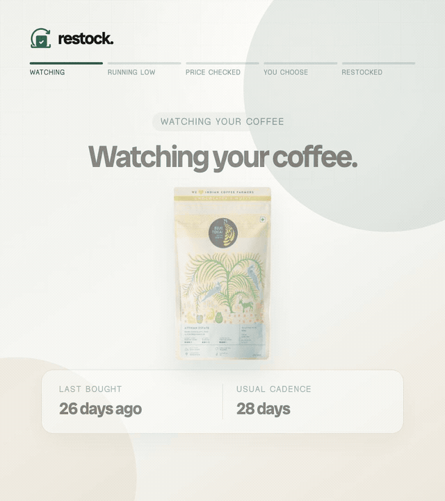

# Prava-Restock: Autonomous Restock & SaaS Renewal Agent

<div align="center">

[](https://github.com/somuai/Prava-Restock/actions)
[](LICENSE)
[](https://python.org)
[](https://fastapi.tiangolo.com)
[](https://react.dev)
[-336791.svg)](https://neon.tech)
[-46E3B7.svg)](https://prava-restock.onrender.com/app/)

**An autonomous replenishment and SaaS renewal system that calculates consumption cadences, tracks price volatility, arbitrates merchant quotes, and delegates transactions via Prava Session Mandates with human-in-the-loop approval on Prava's hosted payment surface.**

> **Notice on Real-Money Execution & AI Safety:** Real-money execution is strictly disabled by default (`real_money_enabled: false`). All payment workflows route exclusively through the Prava Sandbox API using test OTP `456789`. No LLM makes decisions on the purchase path; forecasting uses an Exponentially Weighted Moving Average (EWMA), and while an OpenAI Agents SDK tool surface is defined in `agent/orchestrator.py`, runtime purchase execution in `workflow/service.py` is entirely deterministic.

[Live Demo](https://prava-restock.onrender.com/app/) • [System Architecture](#system-architecture) • [Agentic Capabilities](#agentic-ai-architecture) • [Quick Start](#quick-start) • [Documentation](docs/)

<br />



</div>

---

## Live Sandbox Demo

The application is deployed live with full PostgreSQL ACID persistence, Prava sandbox integration, and an automated 15-minute keep-alive scheduler:

| Access Point | Details |
| :--- | :--- |
| **Live Web App** | [**https://prava-restock.onrender.com/app/**](https://prava-restock.onrender.com/app/) |
| **Public Waitlist** | [**https://prava-restock.onrender.com/**](https://prava-restock.onrender.com/) |
| **Reviewer Password** | `reviewer123` |
| **Sandbox Test OTP** | `456789` (entered on Prava's hosted sandbox page) |
| **Health / Ready** | `/health` (liveness) • `/ready` (DB readiness) • `/capabilities` |

---

## Agentic AI Architecture

Unlike rigid auto-debits (which blindly charge fixed amounts on static calendar dates) or passive generative AI chatbots, Prava-Restock operates as an **autonomous replenishment and renewal workflow**:

```
┌─────────────────────────────────────────────────────────────┐
│                      AGENTIC AI LOOP                        │
│                                                             │
│   1. SENSE / PERCEIVE         2. REASON & PLAN              │
│   (EWMA Depletion Math,        (Compare Merchants,          │
│    Price Spikes, Renewals)      Evaluate Budget Fences)     │
│             │                            │                  │
│             ▼                            ▼                  │
│   3. ACT / TOOL USE           4. HUMAN-IN-THE-LOOP          │
│   (Fetch Live Quotes,          (Prava Hosted Approval Page, │
│    Create Mandates)             Sandbox OTP Verification)   │
│             │                            │                  │
│             └───────────► 5. PERSIST ◄───┘                  │
│                        (State Machine,                      │
│                         Idempotency Key)                    │
└─────────────────────────────────────────────────────────────┘
```

### The 5 Agentic Pillars

1. **Autonomous Perception (`triggers/`)**: Models consumption velocity using Exponentially Weighted Moving Average (EWMA) to forecast replenishment windows (e.g. coffee every 14 days, RO filter every 30 days) alongside live merchant pricing. No generative LLM is in the loop.
2. **Multi-Merchant Reasoning (`workflow/service.py`)**: Gathers quotes across merchants (Zepto, Swiggy, SaaS providers), evaluates prices against thresholds, and selects the lowest-cost available option deterministically.
3. **Financial Safety & Guardrails (`common/` & `storage/`)**: Enforces hard budget fences (Monthly Cap, Per-Item Cap, Per-Transaction Cap). Prevents duplicate orders via PostgreSQL row-level locks (`SELECT ... FOR UPDATE`), a primary-key constraint on `merchant_checkout_attempts.idempotency_key`, and SHA-256 request fingerprinting.
4. **Tool Use & Execution (`payments/prava_client.py`)**: Tokenizes purchase contexts into Prava Session Mandates with scoped merchant boundaries. Owner approval occurs on Prava's hosted payment page using test OTP `456789`; the internal state machine uses the state name `PASSKEY_PENDING`, but no WebAuthn browser API is implemented.
5. **Durable State Machine (`workflow/service.py`)**: Transactional ACID Finite State Machine (PostgreSQL) designed for safe recovery across server restarts and designed to avoid orphaned credentials.

---

## Key Highlights & Concurrency Benchmarks

- **446/446 Automated Tests Passing (100% Green)**: Comprehensive test suite validating FSM transitions, upstream rate-limit recoveries (HTTP 429), and schema boundaries.
- **Concurrency & Idempotency Testing**: Tested in `tests/test_mock_subscription_checkout.py` (`test_concurrent_same_key_calls_create_exactly_one_order`): 16 parallel requests across 8 worker threads using one idempotency key produce exactly one order against the mock merchant checkout, backed by database row-level locking and an idempotency-key primary key.
- **Deterministic Purchase Path**: No LLM makes decisions or generates text that affects purchases. The OpenAI Agents SDK tool surface is defined in `agent/orchestrator.py`, but runtime purchase execution in `workflow/service.py` is entirely deterministic.
- **Two Distinct Operating Tracks**:
  - **Home Track**: Physical consumables (Blue Tokai Coffee, Aquaguard RO Kits, Copier Paper, Toiletries) via Zepto/Swiggy.
  - **Teams Track**: SaaS Subscriptions (GitHub Copilot Business) with automated tier optimization.

---

## Quick Start

### 1. Offline Dry Run (Deterministic Mode)
```bash
# Clone repository
git clone https://github.com/somuai/Prava-Restock.git
cd Prava-Restock

# Create and activate virtual environment
python3 -m venv .venv
source .venv/bin/activate
pip install -r requirements.txt

# Run offline deterministic dry run
python demo/dry_run.py --mode offline
```

### 2. Local API & Frontend Server
```bash
# Apply database migrations
alembic upgrade head

# Start FastAPI backend
uvicorn ui.api:app --reload --port 8000

# Start React PWA (in a separate terminal)
cd ui/web
npm ci
npm run dev
```

### 3. Run Full Test Suite
```bash
pytest -q
# Output: 446 passed in ~24s
```

---

## Security & Guardrail Philosophy

- **Zero-Plaintext Storage**: Scrypt-hashed passwords (`$16384$8$1$`) and HMAC-signed short-lived session cookies.
- **Ephemeral Payment Tokens**: Mandate secrets and session credentials live strictly in memory and are discarded immediately after execution (`CREDENTIAL_LOST_BEFORE_EXPOSURE` policy).
- **Two-Phase Verification**: The agent re-validates stock availability and price constancy right before mandate execution, aborting if price drift is detected.

---

## Documentation & Specifications

- [Product Requirements Document (PRD)](PRD.md)
- [Technical Requirements Specification](TECHNICAL_PRD.md)
- [Visual Design System](docs/design-system.md)
- [Production Readiness Evidence](docs/production_readiness.md)
- [Phase 7 Verification Evidence](docs/phase7_evidence.md)

---

## License

Distributed under the MIT License. See `LICENSE` for more information.
